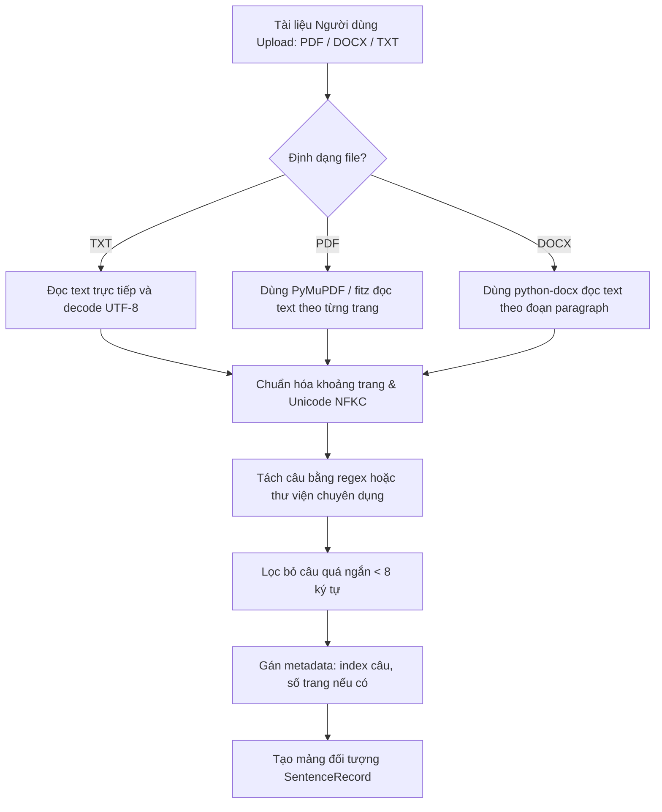
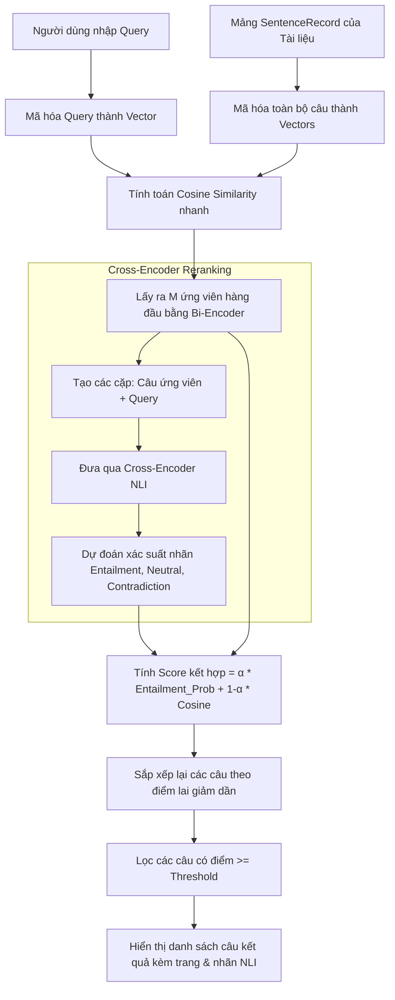
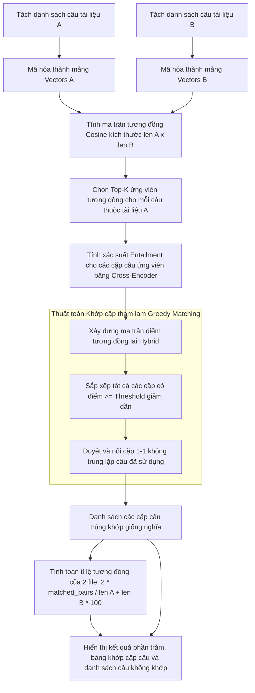

# BÁO CÁO CHI TIẾT DỰ ÁN: SEMANTIC DOCUMENT SIMILARITY SEARCH

Dự án này là hệ thống **Tìm kiếm ngữ nghĩa trong văn bản (Semantic Search)** và **So sánh độ tương đồng giữa hai tài liệu (Document Similarity)** sử dụng dữ liệu **AllNLI** và các mô hình học máy hiện đại (SentenceTransformers, Bi-Encoder, Cross-Encoder). 

Báo cáo dưới đây giúp bạn nắm vững kiến trúc dự án, chức năng từng thư mục/file, luồng dữ liệu (flow), cách hoạt động và hướng dẫn chi tiết cách chạy hệ thống.

---

## 1. Tổng quan & Cách hoạt động (How It Works)

Hệ thống hoạt động dựa trên sự kết hợp giữa hai phương pháp chính trong Tìm kiếm Thông tin (Information Retrieval) và Xử lý Ngôn ngữ Tự nhiên (NLP):

1. **Bi-Encoder (Retrieval nhanh)**: 
   * Sử dụng mô hình `sentence-transformers/all-MiniLM-L6-v2` (được tinh chỉnh thêm trên tập dữ liệu `pair` hoặc `pair-score` của AllNLI).
   * Mã hóa (encode) các câu trong văn bản thành các vector biểu diễn dày (dense embeddings) trong không gian 384 chiều.
   * Khi người dùng nhập câu truy vấn (query), hệ thống mã hóa câu truy vấn đó và tính toán độ tương đồng Cosine (Cosine Similarity) với toàn bộ vector câu trong văn bản để trích xuất ra Top-K câu có độ tương đồng cao nhất.
2. **Cross-Encoder (Reranking chính xác)**:
   * Sử dụng mô hình phân loại NLI (Natural Language Inference) dựa trên `distilbert-base-uncased` được huấn luyện trên tập dữ liệu `pair-class` để phân loại cặp câu thành 3 nhãn: `entailment` (kéo theo/đồng nghĩa), `neutral` (trung lập) và `contradiction` (mâu thuẫn).
   * Do Cross-Encoder nhận cả hai câu đầu vào cùng lúc thông qua các lớp Self-Attention nên độ chính xác của nó cao hơn rất nhiều so với Bi-Encoder. Tuy nhiên, chi phí tính toán lớn hơn nên không thể chạy trên toàn bộ tập dữ liệu thô.
3. **Hệ thống lai (Hybrid Reranker)**:
   * Kết hợp hai mô hình trên theo cấu trúc pipeline chuẩn trong công nghiệp:
     * **Bước 1 (Retrieval)**: Dùng **Bi-Encoder** tìm kiếm nhanh để lấy ra $M$ câu ứng viên đầu tiên (ví dụ: $M = 30$).
     * **Bước 2 (Reranking)**: Dùng **Cross-Encoder** để chấm điểm lại $M$ ứng viên đó dựa trên xác suất nhãn `entailment`.
     * **Bước 3 (Chấm điểm cuối)**: Điểm số cuối cùng là tổng có trọng số:
       $$\text{Score} = \alpha \times \text{Entailment\_Prob} + (1 - \alpha) \times \text{Cosine\_Similarity}$$
       Trong đó $\alpha$ (thường khoảng 0.55) là trọng số điều chỉnh mức độ ưu tiên của Cross-Encoder.

---

## 2. Luồng xử lý dữ liệu (Workflow Flows)

### A. Luồng Tiền xử lý & Trích xuất Tài liệu (Document Processing Flow)


---

### B. Luồng Tìm kiếm ngữ nghĩa (Semantic Search Pipeline)


---

### C. Luồng So sánh hai tài liệu (Document-to-Document Similarity Flow)


---

## 3. Cấu trúc thư mục & Công dụng từng file (Repo Structure & File Purpose)

Dưới đây là chi tiết các thư mục và tệp tin trong mã nguồn:

```text
similarity_search/
  ├── configs/                      # Chứa các file cấu hình định dạng JSON
  ├── data/                         # Chứa dữ liệu (raw, processed) - Bị bỏ qua bởi Git
  ├── docs/                         # Thư mục chứa các tài liệu hướng dẫn và báo cáo
  ├── models/                       # Chứa mô hình sau khi huấn luyện (local) - Bị bỏ qua bởi Git
  ├── notebooks/                    # Thư mục chứa các Jupyter Notebook chạy thực nghiệm
  ├── outputs/                      # Lưu trữ bảng biểu, biểu đồ, kết quả đánh giá (metrics)
  ├── scripts/                      # Các script bổ trợ, so sánh và đồng bộ dữ liệu
  ├── src/                          # Mã nguồn chính của dự án dạng python package
  │   └── similarity_search/
  │       ├── app/                  # Mã nguồn ứng dụng giao diện web Streamlit
  │       ├── data/                 # Logic chuẩn bị dữ liệu và phân tích EDA
  │       ├── evaluation/           # Các script đánh giá chất lượng mô hình
  │       └── models/               # Các script huấn luyện và định nghĩa baseline mô hình
  ├── Dockerfile                    # Hướng dẫn build docker image của dự án
  ├── docker-compose.yml            # Quản lý các container dịch vụ (web, dev, train)
  ├── requirements.txt              # Thư viện core chung của dự án
  ├── requirements-app.txt          # Thư viện phục vụ cho chạy giao diện Web
  ├── requirements-train.txt        # Thư viện phục vụ huấn luyện mô hình sâu (GPU)
  └── pyproject.toml                # Cấu hình đóng gói dự án dạng pip package
```

### Chi tiết công dụng từng file mã nguồn chính

#### Thư mục `src/similarity_search/data/` (Xử lý dữ liệu)
* [text_utils.py](file:///d:/UTE/Natural_Language_Processing/similarity_search/src/similarity_search/data/text_utils.py): Chứa các hàm tiện ích xử lý văn bản ở mức thấp như:
  * `normalize_text()`: Chuẩn hóa unicode NFKC, xóa thẻ HTML, chuyển đổi URL thành token `<URL>`, chuẩn hóa khoảng trắng và viết thường tùy chọn.
  * `simple_tokenize()`: Tách từ tiếng Anh bằng Regex cơ bản.
  * `lexical_overlap()`: Tính toán độ tương đồng từ vựng (Jaccard Overlap) giữa 2 câu.
  * `top_words()`: Thống kê tần suất các từ xuất hiện nhiều nhất (bỏ qua từ dừng `stopwords`).
* [prepare_allnli.py](file:///d:/UTE/Natural_Language_Processing/similarity_search/src/similarity_search/data/prepare_allnli.py): Tải dữ liệu `sentence-transformers/all-nli` từ Hugging Face về máy, lọc nhiễu, chuẩn hóa cột dữ liệu, tính toán các thuộc tính cơ bản như độ dài ký tự, độ dài token, lexical overlap và lưu trữ xuống định dạng Parquet hoặc CSV.
* [eda_allnli.py](file:///d:/UTE/Natural_Language_Processing/similarity_search/src/similarity_search/src/similarity_search/data/eda_allnli.py): Thực hiện phân tích dữ liệu khám phá (Exploratory Data Analysis - EDA), xuất các biểu đồ phân phối nhãn, phân phối độ dài câu, từ khóa nổi bật và ma trận overlap từ vựng vào thư mục `outputs/`.

#### Thư mục `src/similarity_search/models/` (Định nghĩa & Train mô hình)
* [tfidf_baseline.py](file:///d:/UTE/Natural_Language_Processing/similarity_search/src/similarity_search/models/tfidf_baseline.py): Huấn luyện và đánh giá mô hình baseline **TF-IDF**. Nó học bộ từ vựng trên tập train AllNLI, tính toán độ tương đồng Cosine, tối ưu hóa ngưỡng tương đồng trên tập `dev`, lưu trữ vectorizer thành file `.joblib` và xuất kết quả dự đoán ra file `.csv`.
* [minilm_baseline.py](file:///d:/UTE/Natural_Language_Processing/similarity_search/src/similarity_search/models/minilm_baseline.py): Đánh giá mô hình **Pretrained MiniLM** (`all-MiniLM-L6-v2`) chưa qua tinh chỉnh trên dự án để làm thước đo so sánh. Đo lường cả tác vụ phân loại cặp câu và tác vụ tìm kiếm (retrieval) với pool nhiễu kích thước 20.
* [train_biencoder.py](file:///d:/UTE/Natural_Language_Processing/similarity_search/src/similarity_search/models/train_biencoder.py): Script dùng để fine-tune mô hình MiniLM Bi-Encoder trên GPU (Kaggle/Colab) sử dụng hàm loss `MultipleNegativesRankingLoss` để kéo các cặp câu đồng nghĩa lại gần nhau và đẩy các câu khác ra xa.
* [train_cross_encoder.py](file:///d:/UTE/Natural_Language_Processing/similarity_search/src/similarity_search/models/train_cross_encoder.py): Script tinh chỉnh mô hình phân loại NLI Cross-Encoder (dựa trên `distilbert-base-uncased` hoặc các base model khác) trên tập dữ liệu `pair-class` chứa 3 lớp nhãn. Script này cũng thực hiện tính toán độ tương đồng nhị phân, ma trận nhầm lẫn (confusion matrix), tối ưu ngưỡng tương đồng và đánh giá thứ hạng (MRR, Precision@K).

#### Thư mục `src/similarity_search/app/` (Giao diện Web Streamlit)
* [document_utils.py](file:///d:/UTE/Natural_Language_Processing/similarity_search/src/similarity_search/app/document_utils.py): Các hàm phụ trợ đọc văn bản từ file upload:
  * `extract_txt()`: Đọc tệp text đơn thuần.
  * `extract_pdf()`: Dùng thư viện `PyMuPDF` (fitz) để đọc text từ PDF và giữ lại thông tin số trang (page).
  * `extract_docx()`: Dùng thư viện `python-docx` để đọc văn bản từ tệp Word.
  * `split_sentences()`: Tách văn bản dài thành danh sách các câu đơn dựa trên dấu kết thúc câu và chuẩn hóa chúng.
* [similarity_engine.py](file:///d:/UTE/Natural_Language_Processing/similarity_search/src/similarity_search/app/similarity_engine.py): Động cơ cốt lõi phục vụ suy luận (inference) trên giao diện Web. Chứa logic tải mô hình đã lưu, tính điểm tương đồng cho TF-IDF, mã hóa vector bằng Bi-Encoder, suy luận Cross-Encoder, thực hiện thuật toán tìm kiếm ngữ nghĩa lai (hybrid) và khớp cặp tương đồng 1-1 bằng phương pháp tham lam (greedy matches).
* [streamlit_app.py](file:///d:/UTE/Natural_Language_Processing/similarity_search/src/similarity_search/app/streamlit_app.py): Khởi tạo giao diện ứng dụng Web Streamlit gồm 3 tab chức năng:
  * **Tab 1: Semantic Search** (Tìm kiếm ngữ nghĩa dạng Ctrl+F thông minh).
  * **Tab 2: Compare Documents** (So sánh độ tương đồng giữa hai tài liệu).
  * **Tab 3: Benchmark** (Hiển thị các bảng so sánh độ chính xác của các mô hình đã lưu).

#### Thư mục `scripts/` (Các script hỗ trợ)
* [compare_baselines.py](file:///d:/UTE/Natural_Language_Processing/similarity_search/scripts/compare_baselines.py): So sánh các file kết quả đánh giá (metrics.json) của TF-IDF và MiniLM để tạo bảng tổng hợp `outputs/tables/model_comparison.csv`.
* [push_processed_dataset_to_hub.py](file:///d:/UTE/Natural_Language_Processing/similarity_search/scripts/push_processed_dataset_to_hub.py): Hỗ trợ đẩy dữ liệu parquet đã tiền xử lý cục bộ lên Hugging Face Dataset Hub để các thành viên trong nhóm 5 người có thể dễ dàng tải về huấn luyện mô hình ở máy khác/Kaggle/Colab mà không bị lệch phiên bản.
* [md_to_docx.py](file:///d:/UTE/Natural_Language_Processing/similarity_search/scripts/md_to_docx.py): Script tự động chuyển đổi báo cáo định dạng Markdown sang file Word (.docx).

#### Thư mục `configs/`
* [allnli_data.json](file:///d:/UTE/Natural_Language_Processing/similarity_search/configs/allnli_data.json): Chứa thông số cấu hình của tập dữ liệu AllNLI như ánh xạ nhãn số sang tên nhãn (`entailment`, `neutral`, `contradiction`) và trọng số điểm tương đồng tương ứng.

---

## 4. Hướng dẫn sử dụng & Vận hành (Usage)

### A. Cài đặt môi trường trên máy cá nhân (Local Setup)

Bạn có thể cấu hình môi trường Python 3.9+ theo các bước sau:

```powershell
# Tạo môi trường ảo
python -m venv .venv

# Kích hoạt môi trường ảo (Windows)
.\.venv\Scripts\Activate.ps1

# Nâng cấp pip và cài đặt gói thư viện cốt lõi
python -m pip install --upgrade pip
python -m pip install -r requirements.txt
python -m pip install -e .
```

Nếu muốn chạy **Huấn luyện mô hình** (cần GPU):
```powershell
python -m pip install -r requirements-train.txt
```

Nếu muốn chạy **Giao diện Web Streamlit**:
```powershell
python -m pip install -r requirements-app.txt
```

---

### B. Chuẩn bị dữ liệu và chạy EDA nhanh

1. Tải và xử lý dữ liệu AllNLI mẫu (5000 dòng mỗi split để test nhanh):
   ```powershell
   python -m similarity_search.data.prepare_allnli --subsets pair-class --max-rows-per-split 5000
   ```
   *(Để chạy trên toàn bộ dữ liệu làm đồ án thật, bỏ tham số `--max-rows-per-split 5000` và thêm các subset khác: `--subsets pair-class pair-score pair triplet`)*.

2. Chạy thống kê dữ liệu (EDA):
   ```powershell
   python -m similarity_search.data.eda_allnli --subset pair-class
   ```
   Kết quả biểu đồ phân phối sẽ nằm trong mục `outputs/figures/allnli/pair-class/`.

---

### C. Chạy và đánh giá các mô hình cơ sở (Baselines)

1. Huấn luyện và đánh giá mô hình baseline TF-IDF:
   ```powershell
   python -m similarity_search.models.tfidf_baseline
   ```
2. Đánh giá mô hình Pretrained MiniLM:
   ```powershell
   python -m similarity_search.models.minilm_baseline --device cpu
   ```
3. Tạo bảng so sánh kết quả:
   ```powershell
   python scripts/compare_baselines.py
   ```
   Kết quả so sánh sẽ được lưu tại `outputs/tables/model_comparison.csv`.

---

### D. Huấn luyện mô hình nâng cao trên Kaggle (GPU)

Đọc chi tiết tại [KAGGLE_BIENCODER_TRAINING.md](file:///d:/UTE/Natural_Language_Processing/similarity_search/docs/KAGGLE_BIENCODER_TRAINING.md). 

Tóm tắt các bước:
1. Đăng nhập Kaggle, tạo **New Notebook**, đặt cấu hình **Accelerator = GPU T4 x2 hoặc P100** và bật **Internet = On**.
2. Clone mã nguồn từ GitHub của nhóm vào Kaggle và cài đặt thư viện:
   ```bash
   !git clone <URL_GITHUB_CUA_NHOM> /kaggle/working/similarity_search
   %cd /kaggle/working/similarity_search
   !python -m pip install -q -r requirements-train.txt
   !python -m pip install -q -e .
   ```
3. Chạy lệnh train **Bi-Encoder** (MiniLM):
   ```bash
   !python -m similarity_search.models.train_biencoder \
     --output-dir /kaggle/working/allnli-minilm-biencoder \
     --num-train-epochs 1 \
     --batch-size 64
   ```
4. Chạy lệnh train **Cross-Encoder** (DistilBERT):
   ```bash
   !python -m similarity_search.models.train_cross_encoder \
     --output-dir /kaggle/working/allnli-cross-encoder-nli \
     --result-dir /kaggle/working/cross_encoder_outputs \
     --num-train-epochs 1 \
     --batch-size 32
   ```
5. Tải tệp mô hình đã nén (`.zip`) về máy cá nhân từ cửa sổ đầu ra của Kaggle và đặt vào thư mục `models/` của dự án local theo đúng cấu trúc:
   * `models/tfidf_baseline/vectorizer.joblib`
   * `models/allnli-minilm-biencoder/final/` (chứa file `model.safetensors`)
   * `models/allnli-cross-encoder-nli/final/` (chứa file `model.safetensors`)

---

### E. Vận hành Web Demo bằng Docker (Khuyên dùng khi báo cáo)

Sử dụng Docker giúp thống nhất môi trường chạy ứng dụng, tránh các lỗi cài đặt thư viện trên các hệ điều hành khác nhau của thành viên hoặc thầy cô chấm điểm.

1. **Chuẩn bị**: Hãy chắc chắn rằng Docker Desktop đã được bật và đang chạy.
2. **Build và khởi chạy ứng dụng**:
   ```powershell
   # Build image cho web
   docker compose build web
   
   # Khởi chạy dịch vụ web
   docker compose up web
   ```
3. **Truy cập ứng dụng**:
   Mở trình duyệt web bất kỳ và truy cập địa chỉ: [http://localhost:8501](http://localhost:8501)
4. **Tắt ứng dụng**:
   Nhấn `Ctrl + C` trên terminal hoặc chạy lệnh:
   ```powershell
   docker compose down
   ```

---

## 5. Phân công công việc khuyến nghị cho nhóm 5 người

Để tối ưu hóa năng suất và đáp ứng đúng tiến độ đồ án, nhóm nên phân công như sau:

| Thành viên | Nhiệm vụ chính | Sản phẩm đầu ra |
|---|---|---|
| **Thành viên 1** (Data & EDA) | Phụ trách tải dữ liệu AllNLI bằng script, chạy tiền xử lý dữ liệu mẫu/đầy đủ. Thực hiện phân tích thống kê khám phá dữ liệu (EDA), vẽ biểu đồ. | Script tiền xử lý hoàn thiện, biểu đồ phân phối phục vụ viết báo cáo chương 4. |
| **Thành viên 2** (Baseline Models) | Huấn luyện mô hình TF-IDF baseline. Chạy đánh giá mô hình Pretrained MiniLM làm đối chứng. Thiết lập các hàm tính toán metric đánh giá (Precision@K, MRR, Cosine threshold). | Bộ lưu trữ TF-IDF vectorizer, file so sánh chất lượng mô hình baseline. |
| **Thành viên 3** (Bi-Encoder Model) | Huấn luyện mô hình Bi-Encoder (MiniLM) trên Kaggle/Colab GPU. Tinh chỉnh các siêu tham số (epochs, batch size, learning rate). Thực hiện đẩy mô hình lên Hugging Face Hub. | Checkpoint mô hình Bi-Encoder đã fine-tune đạt điểm số tương đồng tốt. |
| **Thành viên 4** (Cross-Encoder & Hybrid) | Huấn luyện mô hình Cross-Encoder phân loại NLI trên Kaggle/Colab GPU. Thiết lập thuật toán chấm điểm lai (Hybrid score) kết hợp điểm Cosine và điểm Entailment. | Checkpoint mô hình Cross-Encoder, thuật toán Reranking kết hợp. |
| **Thành viên 5** (Web & Docker App) | Thiết kế giao diện ứng dụng Web Streamlit. Tích hợp chức năng upload file và tách câu tự động. Cấu hình Dockerfile và docker-compose. Quay video demo thuyết trình. | Ứng dụng Streamlit hoàn thiện chạy mượt mà trên Docker, video demo 3-5 phút. |

---

## 6. Lời khuyên viết báo cáo Đồ án tốt nghiệp / Đồ án môn học

1. **Không commit mô hình và dữ liệu Parquet lớn lên GitHub**: 
   * Tránh việc repo bị nặng và clone chậm. Sử dụng Hugging Face Dataset Hub để chia sẻ dữ liệu tiền xử lý giữa các thành viên.
   * Đăng ký tài khoản Hugging Face để tải mô hình sau khi train lên Model Hub, sau đó code web chỉ cần chỉ định ID của mô hình (ví dụ: `nhom_nlp/allnli-minilm-biencoder`) để tự động tải về khi chạy lần đầu.
2. **Chọn ngưỡng tương đồng (Threshold)**:
   * Tránh việc lựa chọn ngưỡng một cách cảm tính (ví dụ: mặc định chọn 0.75). Hãy viết rõ trong báo cáo rằng nhóm **tìm ngưỡng tối ưu trên tập phát triển (dev split)** để đạt F1-score cao nhất, sau đó mới dùng ngưỡng này để đánh giá độc lập trên **tập kiểm thử (test split)**. Điều này giúp báo cáo mang tính khoa học cao.
3. **Chức năng so sánh hai file văn bản**:
   * Khi so sánh hai tài liệu, thứ tự các câu có thể bị đảo lộn (ví dụ: câu 1 của file A khớp với câu 10 của file B). 
   * Hãy trình bày rõ thuật toán **Greedy Matching** (Khớp tham lam 1-1) mà dự án đang sử dụng: hệ thống tính toán ma trận tương đồng giữa tất cả các cặp câu, sắp xếp điểm từ cao xuống thấp và ghép cặp ưu tiên giảm dần, đảm bảo một câu không bị ghép trùng lặp nhiều lần.
